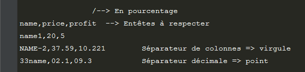
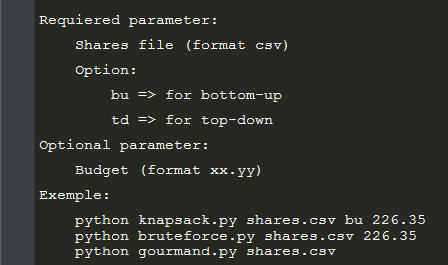

# AlgoInvest&Trade #

1.  [Description](#description)
2.  [Utilisation](#utilisation)
    1.  [Les csv](#format-csv)
    2.  [Les scripts](#use-scripts)
    3.  [L'analyzer](#use-analyzer)
3.  [Installation](#installation)
4.  [À propos](#a-propos)
    1.  [Bugs connus](#bugs-connus)
    2.  [Améliorations futures](#ameliorations-futures)

# Description  #

    Ce script à été réalisé dans le cadre d'un projet du parcours
    'Développeur d'application - Python' d'OpenClassRooms.

 Objectif :\
 Trouver la combinaison d'actions qui rapporte le plus, à partir d'un  fichier (csv) contenant une liste d'actions.

Contraintes :
- 500 euros maximun par client.
- Actions indivisibles.
- Actions uniques.

La solution est écrite dans un fichier .txt placé dans le dossier => `./results/`

\
3 types d'algorithmes sont présentés, dont un sous deux variantes.

**L'approche bruteforce :**\
Consiste à essayer toutes les combinaisons possibles (hors simple permutations),
avant d'en dégager celle au gain maximal.

__L'approche grourmand (ou greedy)__ :\
Construit la combinaison en y ajoutant succesivement les actions au profit le 
plus grand (quand le budget restant le permet).\
L'ordonnance des actions est faite par le script.

\
Le script évalue le plus intéressant entre, acheter une action et ne pas l'acheter.\
Utilise une matrice pour éviter de recalculer ce qui l'à déjà été.
-   **Version - Top-Down :**\
    Trouve la combinaison en utilisant la récursivité.
-   **Version - Bottom-Up :**\
    Trouve la combinaison en utilisant les boucles.

# Utilisation #

### Les csv  ###

Pour lire et exploiter la liste des actions, les scripts attendent un format particulier.\

### Les scripts  ###

Depuis un terminal de commande :\

### L'analyzer  ###

Permet de relancer un script avec son csv, mais en utilisant de moins en moins d'actions écrites dans le csv.\
Cela permet de générer un graph de la durée d'exécution du script analysé en fonction du nombre d'actions, et de connaître la taille (en octet) des principales variables nécessaire au script.

`$ python analyze_bruteforce.py shares.csv`\
`$ python analyze_gourmand.py shares.csv`\
`$ python analyze_knapsack.py shares.csv bu`

Remarque :
- La taille des variables n'est donnée que pour la lecture du csv complèt.
- Les `analyze_*.py` utilisent les mêmes paramètres que les scripts.
- Nécessite des dépendances à installer (voir [Installation](#installation)).
- Pour gourmand :
    -   À la place du graph, l'analyzer écrit un .txt avec les données nécessaires pour pouvoir produire le graph sous excel ou autre tableur (car avec matplotlib, je ne sais pas créer l'échelle logarithmique nécessaire à ce graph).
- Pour knapsack :
    -   Pour bottom-up et top-down, l'analyse prend environ 10 minutes et 20 minutes.

# Installation  #

Clonez ce dépôt à l'aide de la commande `$ git clone https://github.com/geoffrey-ll/P07_GL_AlgoInvest-Trade` ou téléchargez-le [ici](https://github.com/geoffrey-ll/P07_GL_AlgoInvest-Trade/archive/refs/heads/master.zip).

Les différentes approches pour la résolution du problème n'ont pas de dépendance à installer.

\
Analyzer :\
Pour installer ses dépendances, utilisez `$ pip install -r ./analyzer/requierement.txt`

# À propros  #

## Bugs connus  ##

Aucun bug connu.

\
Si vous trouvez un bug, merci de me le signaler sur l'adresse\
gl_openclassrooms@laposte.net

## Améliorations futures  ##

Pour gourmand.py & knapsack.py:
- Un cheapest (prix de l'action la plus basse, notons-là min1) est utilisé pour éviter des itérations. Seulement il garde la même valeur tous le long du script, y compris après que cette fameuse action min1 est été évaluée.\
Il serait plus pertinant que le cheapest change de valeur pour min(i+) (ième valeur la plus basse non évaluée), après que l'action min(i) est été évaluée.\
Cela pourrait réduire encore le nombre d'itérations. À mettre en parrallèle face au nombre d'itérations nécessaire pour implémenter cette fonction.
